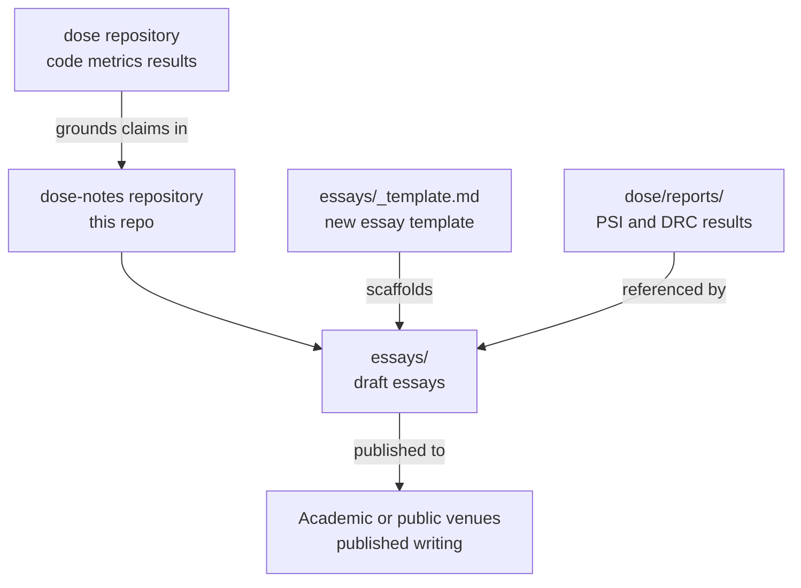

# dose-notes

Critical Theory companion to [dose](https://github.com/hinanohart/dose).

Essays, philosophical commentary, and interpretive framing for the `dose` dual-use evaluation experiment. Narrative and critical analysis live here; code and metrics stay in the `dose` core.

## Architecture

## What this is

`dose-notes` holds all interpretive work related to the [`dose`](https://github.com/hinanohart/dose) experiment: philosophical framing, critical theory essays, and draft writings intended for academic or public venues. The `dose` core library is deliberately free of narrative — this companion repository is where that narrative lives.

## Contents

| Path | Description |
|---|---|
| `essays/` | Draft essays and critical commentary |
| `essays/_template.md` | Template for new essays (abstract, body, references, relation to dose results) |
| `LICENSE` | CC-BY-4.0 |

## Writing a new essay

1. Copy `essays/_template.md` to a new file under `essays/`.
2. Fill in title, author, date, and status (`draft` | `review` | `published`).
3. Ground any quantitative claims in reproducible results from the `dose` repository — link to specific reports in `dose/reports/`.
4. Open a PR using a `feat/<topic>` branch.

## Scope

**In scope:**
- Philosophical framing of the dose experiment
- Critical theory essays related to dual-use evaluation
- Draft writings for academic or public venues
- Interpretive commentary on PSI and DRC results

**Out of scope (belongs in `dose`):**
- Python code
- Experimental data or metrics
- Release artifacts

## Contributing

See [CONTRIBUTING.md](CONTRIBUTING.md). Branch convention: `feat/<topic>`, `fix/<topic>`, or `chore/<topic>` off `main`. One logical change per PR.

## Citation

If you use this work, please cite it using the metadata in [CITATION.cff](CITATION.cff).

## License

[CC-BY-4.0](LICENSE) — Hinano Hart
